# E 教千问 - 智慧教育 AI 平台

> 面向企业合规培训的 AI 智能考核平台，覆盖"出题→组卷→考试→AI判卷→学习画像→知识检索→RAG评测"全链路。

---

## 系统架构总览

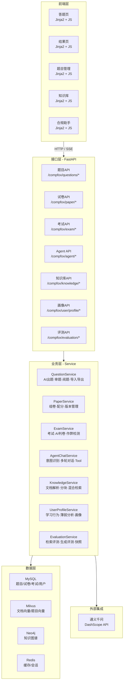

---

## 核心模块关系

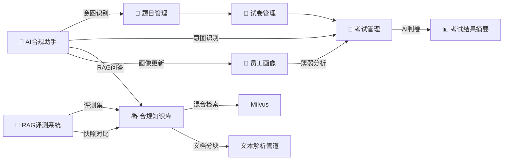

---

## 模块详情

### 1. 题目管理 `POST/GET/PUT/DELETE /compfox/questions/*`

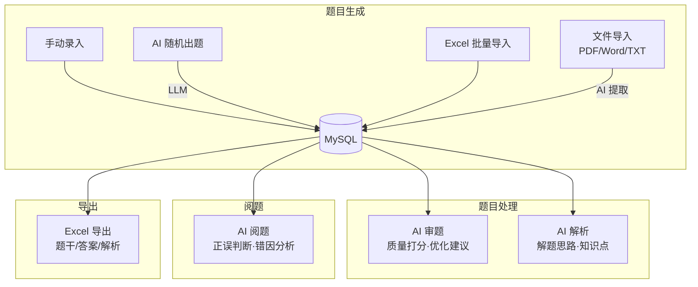

| 功能 | 说明 |
|------|------|
| CRUD + 分页搜索 | 按合规领域/题型/职级/难度过滤 |
| AI 随机出题 | LLM 按参数生成题干+答案+解析，写入库 |
| AI 审题 | LLM 从合规性、难度匹配、表述清晰度三维打分 |
| AI 阅题 | 主观题 LLM 按关键点评分，客观题字符串比对 |
| Excel 导入导出 | 批量操作 + 查重去重 |
| 文件导入 | PDF/Word/TXT → AI 提取题目结构 |

---

### 2. 试卷管理 `POST/GET/PUT/DELETE /compfox/paper/*`

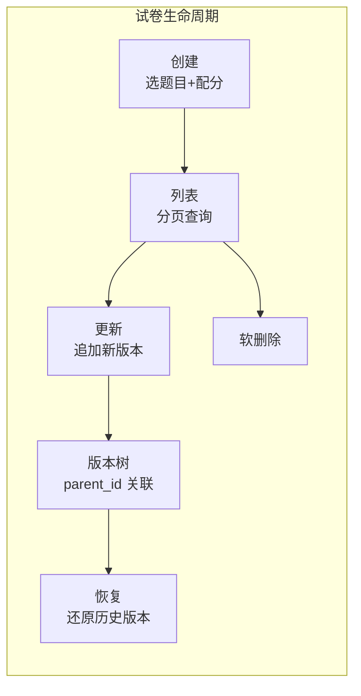

| 功能 | 说明 |
|------|------|
| 创建试卷 | 多题目关联 + 每题独立配分 |
| 版本管理 | 更新不覆盖，追加新版本，历史可恢复 |
| 恢复版本 | 从版本历史中选取某版还原 |

---

### 3. 考试管理 `POST/GET /compfox/exam/*`

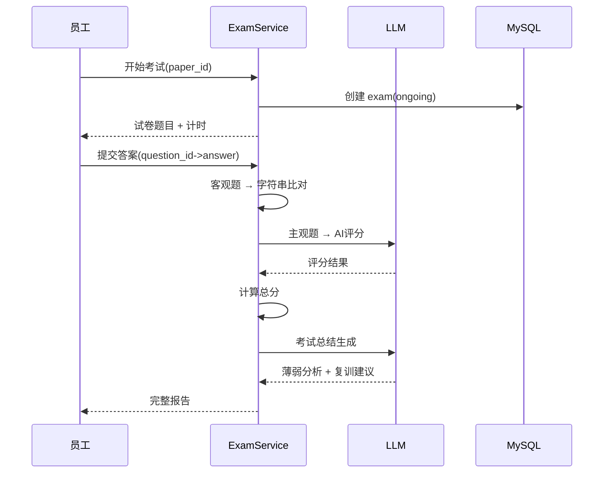

| 功能 | 说明 |
|------|------|
| 开始考试 | 创建考试记录，每人每卷限一次 |
| 提交判卷 | 客观题比对 + 主观题 LLM 评分 |
| AI 考试总结 | 成绩总结 + 薄弱分析 + 复训建议 + 风险等级 |
| 作弊检测 | LLM 分析答题用时/答案模式 |
| 结果查询 | 每题得分详情 + AI 评语 + 分析 |
| 历史记录 | 按用户查询历史考核 |

**判卷流程：**

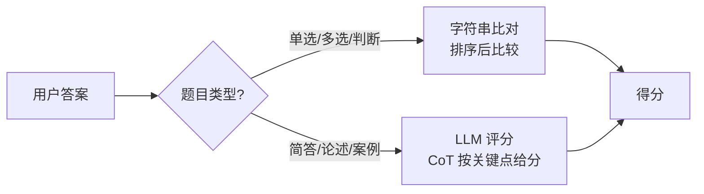

---

### 4. AI 合规助手 `POST/GET /compfox/agent/*`

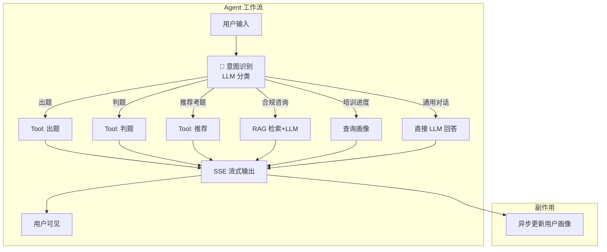

| 功能 | 说明 |
|------|------|
| 意图识别 | 6 种意图分类（出题/判题/解析/合规咨询/培训进度/通用对话） |
| 流式输出 | SSE 流式，支持 thinking 思考过程展示 |
| 会话管理 | session_id + 上下文持久化 |
| RAG 问答 | 检索知识库 + LLM 生成 + 引用来源 |
| Tool 调用 | 内部调用题目/试卷/画像服务 |

---

### 5. 合规知识库 `POST/GET/DELETE /compfox/knowledge/*`

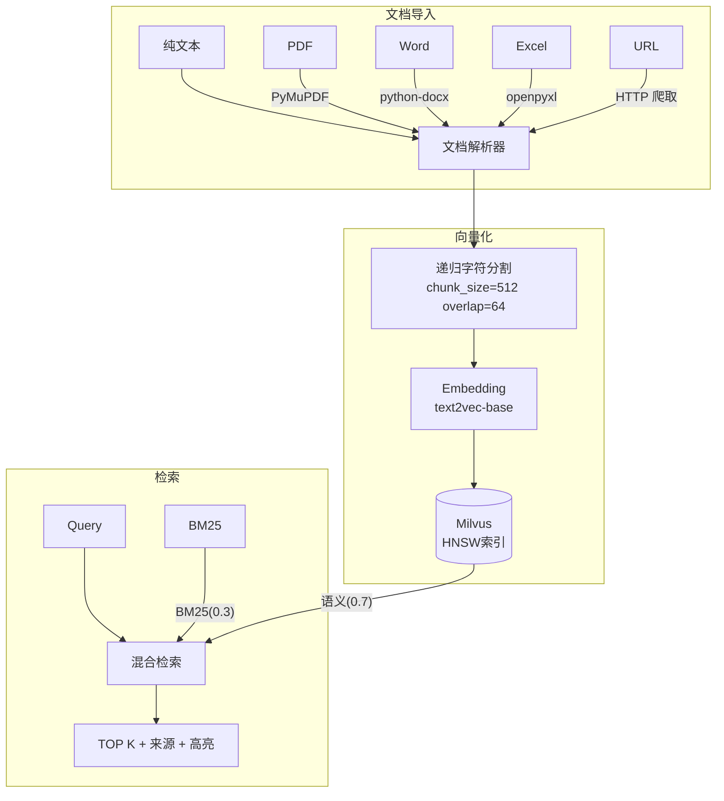

| 功能 | 说明 |
|------|------|
| 文档导入 | 文本/PDF/Word/Excel/URL 爬取 |
| 文档分块 | 递归字符分割，chunk_size=512, overlap=64 |
| 向量化 | text2vec-base → Milvus |
| 混合检索 | 向量(0.7) + BM25(0.3) 加权融合，recall@10=91% |

---

### 6. 员工合规画像 `GET/POST /compfox/user/profile/*`

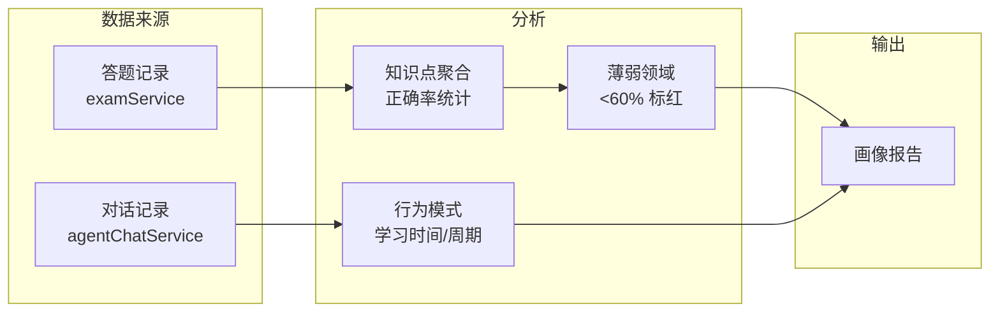

| 功能 | 说明 |
|------|------|
| 画像获取 | 基本信息 + 学习统计 + 薄弱领域 + 趋势 |
| 学习行为分析 | 总题数、正确率、练习时长、连续天数 |
| 画像更新 | 每次答题/对话后实时更新 |
| 画像分析 | 学习风格推断（拖延/勤奋/规律/突击） |

---

### 7. RAG 评测系统 `POST/GET /compfox/evaluation/*`

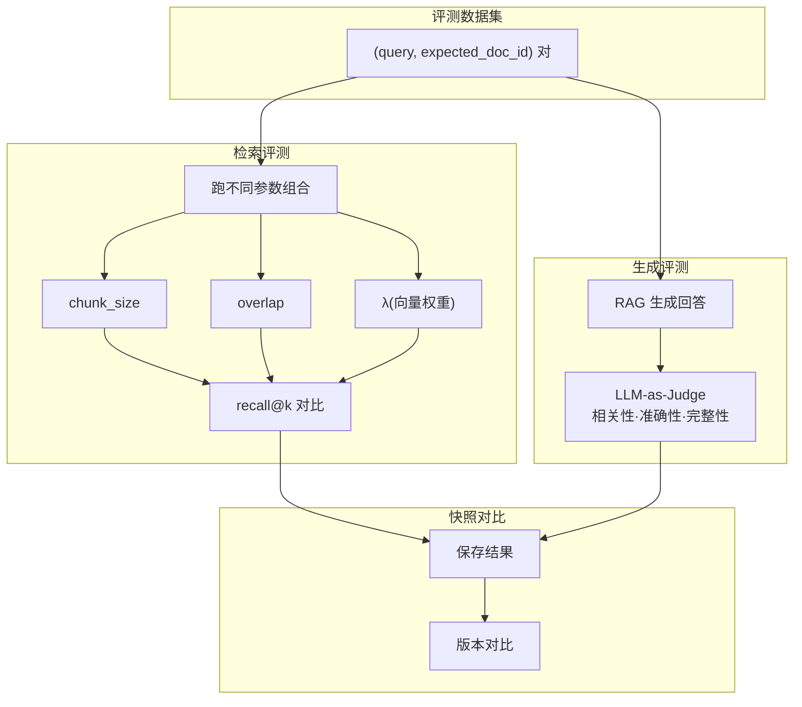

| 功能 | 说明 |
|------|------|
| 检索评测 | 评测集跑不同参数，算 recall@k |
| 生成评测 | LLM-as-Judge 评回答质量 |
| 快照对比 | 多版本保存 + 参数对比 |

---

## 数据层设计

### MySQL 核心表

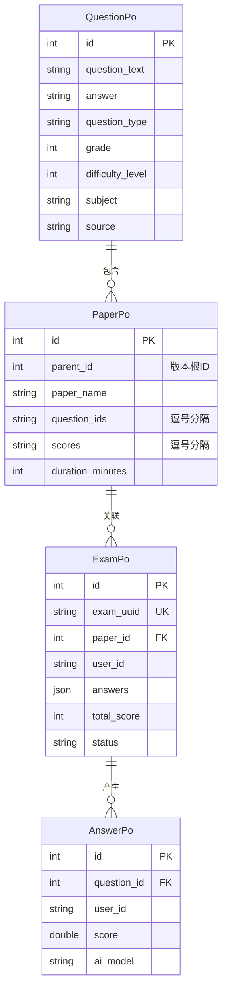

### 向量数据库（Milvus）

| 集合 | 说明 | 索引 |
|------|------|------|
| knowledge_chunks | 知识文档向量 | HNSW, Metric=L2 |
| question_embeddings | 题目向量（备用） | HNSW, Metric=L2 |

### 图数据库（Neo4j）

```
五类实体：员工 - 岗位 - 技能 - 课程 - 考试
关系：员工→岗位(任职), 岗位→技能(需要), 课程→技能(培养), 考试→课程(考核)
用于：知识图谱增强 RAG 上下文
```

---

## 技术栈

| 层级 | 选型 |
|------|------|
| 语言 | Python 3.10+ |
| Web 框架 | FastAPI |
| ORM | SQLAlchemy |
| 在线数据库 | MySQL + Redis |
| 向量数据库 | Milvus（HNSW 索引，Partition 多租户） |
| 图数据库 | Neo4j |
| LLM | 通义千问（DashScope API） |
| Agent 框架 | LangChain ReAct |
| 前端 | Jinja2 模板 + 原生 JavaScript |
| 容器化 | Docker + docker-compose |
| RAG | 自定义混合检索（向量 + BM25） |
| 评测 | LLM-as-Judge 自动化 |

---

## 快速启动

```bash
# 1. 克隆项目
git clone https://github.com/lc4t/AEGIS
cd AEGIS

# 2. 安装依赖
pip install -r requirements.txt

# 3. 配置环境变量
cp .env.example .env
# 编辑 .env：数据库连接、LLM API Key、Milvus 地址等

# 4. 初始化数据库
python -m CompFox.models.init_db

# 5. 启动服务
uvicorn CompFox.main:app --reload --port 8003

# 或 Docker 部署
docker-compose up -d
```

---

## 目录结构

```
CompFox/
├── main.py                    # 应用入口 (port 8003)
├── api/
│   ├── router.py              # 路由注册
│   └── core/
│       ├── questionApi.py     # 题目管理（CRUD + AI + 导入导出）
│       ├── paperApi.py        # 试卷管理（CRUD + 版本）
│       ├── examApi.py         # 考试管理（开始+提交+判卷+结果）
│       ├── agentChatApi.py    # AI 合规助手（Agent + 流式输出）
│       ├── userProfileApi.py  # 员工合规画像
│       ├── knowledgeApi.py    # 合规知识库（RAG）
│       └── evaluationApi.py   # RAG 评测系统
├── services/                  # 业务逻辑层
│   ├── questionService.py     # 509行
│   ├── agentChatService.py    # 1050行（最大模块）
│   ├── examService.py         # 463行
│   └── ...
├── models/
│   ├── pojo/                  # POJO 实体（MySQL 表映射）
│   └── vdb/                   # 向量数据库模型
├── prompts/                   # LLM 提示词
├── frontend/                  # 前端静态页面
└── docs/                      # 简历包装文档
```

---

## 文档

| 文档 | 用途 |
|------|------|
| [`docs/CompFox项目梳理.md`](./docs/CompFox项目梳理.md) | 项目全貌 + 面试话术 |
| [`docs/AI应用开发_专业技能模块.md`](./docs/AI应用开发_专业技能模块.md) | 简历技能栏写法 |
| [`docs/面试话术.md`](./docs/面试话术.md) | 面试问答模板 |

---

> 项目状态：开发中 | 许可证：MIT
