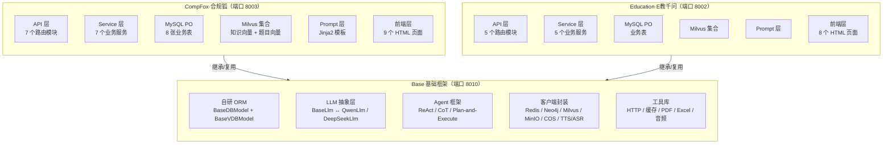
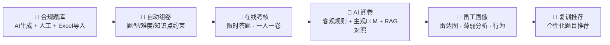
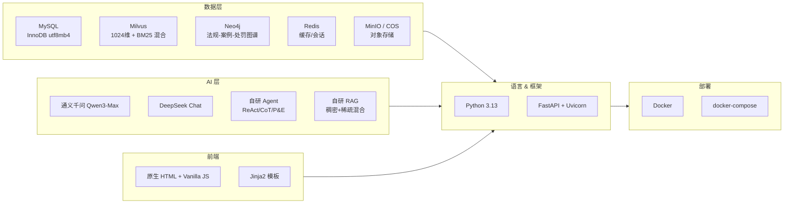
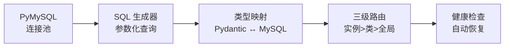
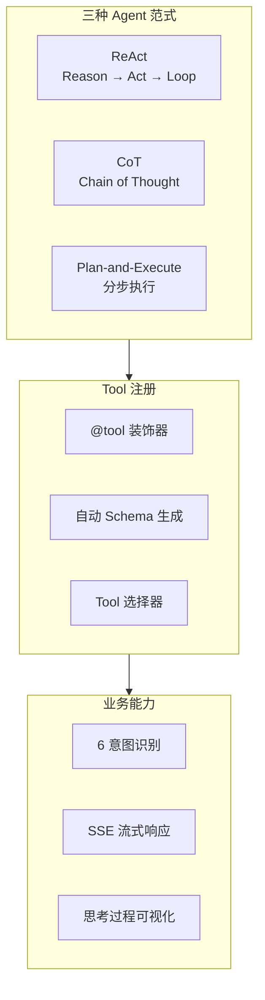
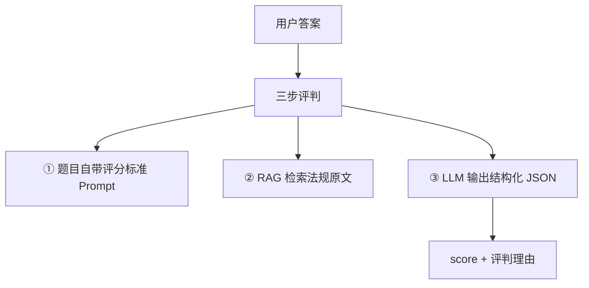
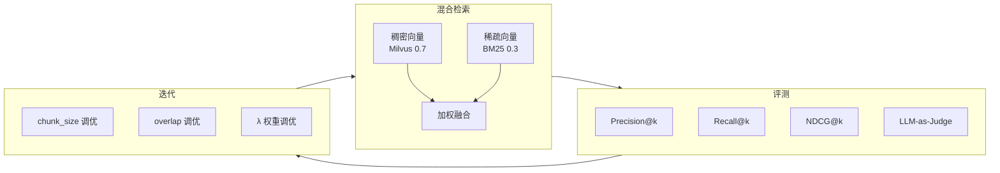
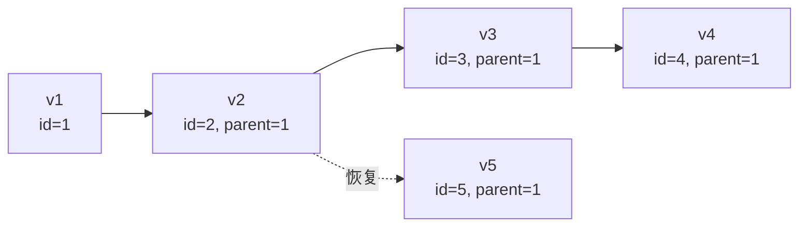
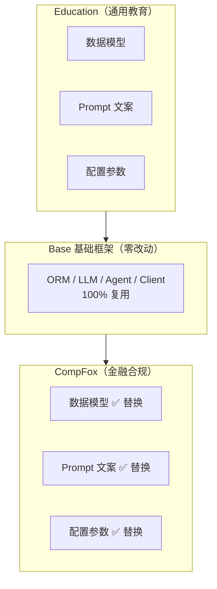

<p align="center">
  
  
  
  
  
  
</p>

# AEGIS — AI 驱动的企业级培训考核平台

> AI-powered Enterprise Training & Assessment Platform with full lifecycle coverage.

---

## Monorepo 架构总览



---

## 模块定位

| 模块 | 定位 | 端口 | 说明 |
|:---|:---|:---:|:---|
| **Base** | 通用基础框架 | 8010 | ORM、LLM 抽象、Agent、客户端封装、工具库 |
| **CompFox（合规狐）** | 金融合规培训与能力评估 | 8003 | 面向银行/证券/保险的合规考核平台 |
| **Education（E教千问）** | 智能教育 AI 平台 | 8002 | 面向学校的 AI 教学辅助平台 |

---

## 核心业务流程



---

## 技术栈



| 层级 | 技术选型 |
|:---|:---|
| 语言 | Python 3.13 |
| Web 框架 | FastAPI + Uvicorn（异步 + 同步混合，SSE 流式响应） |
| ORM | **自研**（PyMySQL + Pydantic + DBUtils，参数化查询防 SQL 注入） |
| LLM | 通义千问 Qwen3-Max / DeepSeek Chat，OpenAI SDK 统一接口，一键切换 |
| Agent 框架 | **自研** ReAct / CoT / Plan-and-Execute 多范式，Tool 注册 + Memory 管理 |
| 向量数据库 | Milvus（1024 维稠密向量 + BM25 稀疏向量混合检索） |
| 图数据库 | Neo4j（法规-案例-处罚关系图谱） |
| 关系数据库 | MySQL（InnoDB, utf8mb4） |
| 缓存 | Redis（LLM 结果缓存、会话上下文） |
| 对象存储 | MinIO / 腾讯云 COS |
| 语音 | 通义千问 ASR（语音转文字）/ TTS（文字转语音） |
| 前端 | 原生 HTML + Vanilla JS + Jinja2 模板渲染 |
| 部署 | Docker + docker-compose |

---

## 核心亮点

### 1. 自研 ORM 框架



不依赖 SQLAlchemy，从零构建。参数化查询强制防 SQL 注入，三级优先级数据库路由（实例级 > 类级 > 全局默认），连接池健康检查与自动恢复，DDL 自动生成。

### 2. AI Agent 多范式框架



实现 ReAct、CoT、Plan-and-Execute 三种 Agent 范式，`@tool` 装饰器自动注册机制。业务中实现 6 意图识别 + SSE 流式响应 + 思考过程可视化的对话系统。

### 3. 主观题 AI 阅卷



三层评判架构，解决合规案例分析类主观题的自动评分难题。

### 4. RAG 混合检索与评测闭环



Milvus 稠密向量（70%）+ BM25 稀疏向量（30%）混合检索，中文递归分块策略。自建评测数据集，快照对比驱动参数迭代。

### 5. 试卷版本控制



修改不覆盖，`parent_id` 创建新版本。支持版本历史追溯与回滚，满足金融合规审计要求。

### 6. 题目质量全生命周期管理

```
50+ 维特征宽表：
  - 统计特征：正确率、区分度
  - 干预特征：干扰项效力
  - 知识图谱特征
  - 运维特征

熔断状态机：Normal → L1观察 → L2干预 → L3冻结
```

### 7. 行业平移能力



Education（通用教育）→ CompFox（金融合规）的行业平移过程中，架构代码零改动，只换了数据模型、Prompt 文案和配置参数。

---

## 项目目录

```
D:\AEGIS/
├── Base/                          # 通用基础框架
│   ├── Ai/                        #   LLM 抽象 + Agent 框架 + Prompt
│   │   ├── base/                  #   BaseLlm / BaseAgent / BaseTool / BaseMemory
│   │   ├── llms/                  #   QwenLlm / DeepSeekLlm
│   │   └── agents/                #   NL2CypherAgent
│   ├── Api/                       #   Auth API / Chat API
│   ├── Client/                    #   Redis / Neo4j / Milvus / MinIO / COS / TTS
│   ├── Config/                    #   Pydantic V2 Settings / 日志配置
│   ├── Models/                    #   User / Session / Conversation
│   ├── Repository/                #   自研 ORM（BaseDBModel / BaseVDBModel）
│   ├── Service/                   #   Auth / Email / ASR / TTS / Memory
│   ├── RicUtils/                  #   HTTP / RedisCache / PDF / Excel / Audio
│   └── main.py                    #   FastAPI 入口（端口 8010）
│
├── CompFox/                       # 金融合规培训平台
│   ├── api/core/                  #   7 个 API 路由
│   ├── services/                  #   7 个业务服务
│   ├── models/pojo/               #   MySQL PO 模型（8 个表）
│   ├── models/vdb/                #   Milvus VDB 模型
│   ├── prompts/                   #   Jinja2 Prompt 模板
│   ├── db/                        #   初始化 / Mock 数据 / 测试脚本
│   ├── frontend/                  #   9 个 HTML 页面 + static
│   └── main.py                    #   FastAPI 入口（端口 8003）
│
├── Education/                     # 智能教育 AI 平台
│   ├── api/core/                  #   5 个 API 路由
│   ├── services/                  #   5 个业务服务
│   ├── models/                    #   PO 模型 + VDB 模型
│   ├── prompts/                   #   Prompt 模板
│   ├── db/                        #   初始化 + Mock 数据
│   ├── frontend/                  #   8 个 HTML 页面 + static
│   └── main.py                    #   FastAPI 入口（端口 8002）
│
├── docs/                          # 项目文档
├── logs/                          # 日志输出
├── .env.template                  # 环境变量模板
├── .env.docker                    # Docker 部署环境变量
├── requirements.txt               # 依赖清单
└── docker-compose.yml             # Docker 编排
```

---

## 快速启动

### 前置依赖

- Python 3.13+
- MySQL 8.0+
- Redis
- Milvus 2.4+
- Neo4j（可选）
- MinIO（可选）

### 1. 克隆 & 配置

```bash
git clone https://github.com/<your-username>/AEGIS.git
cd AEGIS

# 复制环境变量模板并填入真实值
cp .env.template .env
```

### 2. 安装依赖

```bash
python -m venv venv
# Windows
venv\Scripts\activate
# macOS / Linux
# source venv/bin/activate

pip install -r requirements.txt
```

### 3. 初始化数据库

```bash
# 创建 MySQL 数据库
mysql -u root -p -e "CREATE DATABASE IF NOT EXISTS for_student CHARACTER SET utf8mb4;"

# 初始化 CompFox 题库表
python CompFox/db/questionDbInit.py
```

### 4. 启动服务

```bash
# 方式一：单模块启动
uvicorn CompFox.main:app --host 0.0.0.0 --port 8003 --reload

# 方式二：Docker 部署
docker-compose up -d
```

### 5. 访问

| 服务 | 地址 |
|:---|:---|
| CompFox | http://localhost:8003 |
| Education | http://localhost:8002 |
| API 文档 | http://localhost:8003/docs |

---

## 端口分配

| 端口 | 模块 | 说明 |
|:---:|:---|:---|
| 8003 | CompFox | 金融合规培训全业务 |
| 8002 | Education | 智能教育全业务 |
| 8010 | Base | Auth 认证 + AI Chat + 定时任务 |

---

## 核心数据表

### CompFox（合规培训）

| 表名 | 说明 | 关键特性 |
|:---|:---|:---|
| `compfox_questions` | 合规题库 | 30+ 字段，3 种格式支持，AI 元数据，版本控制，软删除 |
| `compfox_papers` | 合规试卷 | `parent_id` 版本控制，三维约束组卷 |
| `compfox_exams` | 考试记录 | JSON 答案+分数详情，一人一卷，AI 总结 |
| `compfox_answers` | 答题记录 | 按题记录，含 AI 评判完整 trace |
| `compfox_user_profiles` | 员工合规画像 | JSON 统计/掌握度/弱点/行为分析/AI 摘要 |
| `question_feature_engineering` | 题目特征工程 | 50+ 维特征，熔断状态机 |

### Milvus 向量集合

| 集合名 | 说明 | 维度 |
|:---|:---|:---:|
| `compliance_knowledge` | 合规知识 Chunk | 1024 稠密 + BM25 稀疏 |
| `question` | 题目语义向量 | 1024 稠密 + BM25 稀疏 |

---

## RAG 评测结果

| 配置 | Precision@3 | Recall@5 | MRR | NDCG@5 |
|:---|:---:|:---:|:---:|:---:|
| Chunk 300, Overlap 50 | 0.73 | 0.72 | 0.80 | 0.70 |
| Chunk 500, Overlap 80 | 0.60 | 0.65 | 0.72 | 0.62 |

---

## 文档

- [项目概述](docs/AEGIS-项目概述.md) — 整体介绍、架构、技术选型
- [CompFox 技术规格书](docs/compfox-development-spec.md) — 详细设计与开发规范
- [行业迁移指南](docs/compfox-migration-guide.md) — Education → CompFox 改造记录

---

## 许可

本项目基于 [MIT License](LICENSE) 开源。

---

<p align="center">
  Built with ❤️ and Python
</p>
